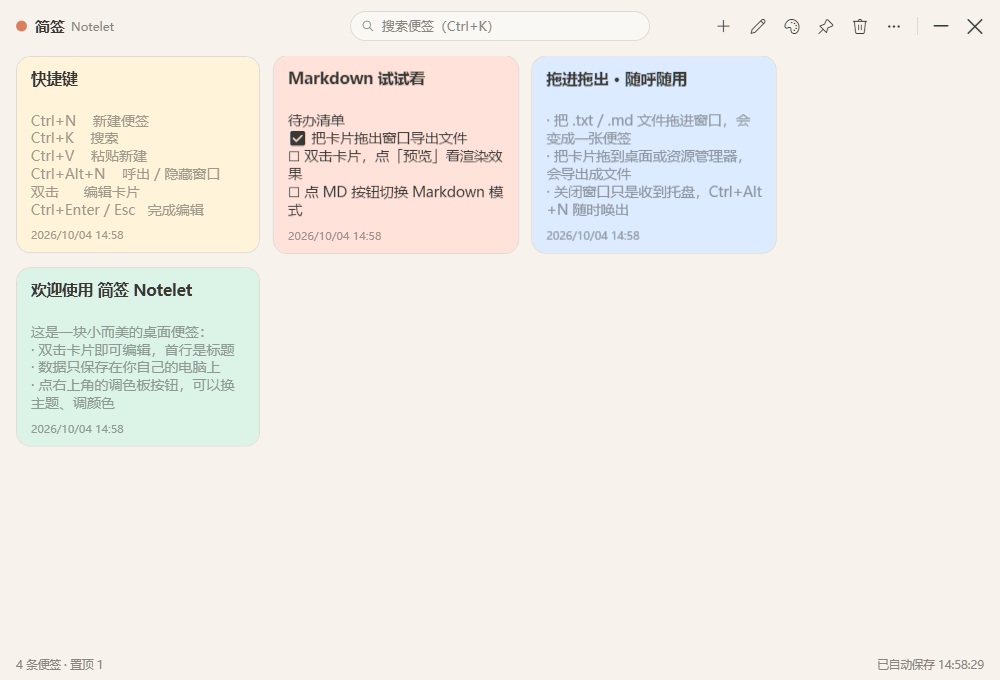

# 简签 Notelet

> 小而美的 Windows 桌面便签：拖进拖出、随心美化、轻量省内存。




## ✨ 特性

- **卡片便签墙** —— 双击空白处 / `Ctrl+N` 新建；双击卡片直接编辑，首行自动作为标题
- **Markdown** —— 卡片上的 **MD** 按钮开启后，正文按 Markdown 渲染（标题/列表/任务清单/引用/代码块/粗体/斜体/删除线/行内代码/链接）；编辑中可一键切换「预览」，预览里**直接点击任务框勾选**，自动回写原文；编辑时实时显示字数
- **图片便签** —— 拖入图片文件或 `Ctrl+V` 粘贴截图，自动保存到本地数据目录并在卡片上显示缩略图；预览、磁贴中按 `` 内嵌显示；拖出/导出文件时图片随行
- **快速便签** —— `Ctrl+Alt+Q`（或托盘菜单）随手唤出小窗，**可多开**，关闭即保存进便签墙，空内容自动丢弃
- **拖进来** —— 把 `.txt` / `.md` / `.log` / `.csv` 等文本文件**或图片**拖进窗口，即变成便签（文本自动识别 UTF-8 / GB18030 编码）；复制文字后 `Ctrl+V` 也能直接变成新便签
- **拖出去** —— 按住卡片拖到桌面或资源管理器，即导出为文件（Markdown 便签导出为 `.md`，其余为 `.txt`；有图片时一并拖出）
- **磁贴模式** —— 点卡片上的图钉图标，把便签贴在桌面上随时速览/复制；跟随主题与卡片配色，便签编辑实时刷新、删除自动收起
- **托盘随呼随用** —— 关闭窗口自动最小化到托盘，全局热键 `Ctrl+Alt+N` 随时唤出/隐藏
- **卡片右键菜单** —— 右键卡片：置顶 / 磁贴速览 / 复制全文 / **导出为 PNG 图片**（2 倍清晰度，适合分享到聊天）/ 导出文件 / 删除
- **设置中心** —— 更多菜单（或托盘、或 `Notelet.exe --settings`）打开：通用开关（开机自启 / 关闭到托盘 / 跟随系统深浅色 / 窗口置顶）、快捷键一览、数据目录与备份管理、关于
- **随心美化** —— 6 套预设主题（暖纸 / 墨夜 / 薄荷 / 蜜桃 / 云母 / 亚克力夜），支持自定义窗口底色、卡片底色、强调色、文字色、圆角、字号、卡片宽度、字体，并可用 **Windows 11 原生云母 / 亚克力毛玻璃**背景；主题可导出 / 导入（JSON）
- **10 色便签色签** —— 每张卡片可单独配色，深浅底色自动适配文字颜色
- **精致细节** —— 细滚动条、深色圆角工具提示、卡片悬浮缩放动效、空状态插画、图标化菜单、置顶便签、窗口置顶、回收站（误删可恢复）、实时搜索（`Ctrl+K`）、自动保存 + 启动时自动备份（保留最近 10 份）、单实例运行

## 📦 下载运行

从 [Releases](../../releases) 下载 zip 解压，运行 `Notelet.exe`。

- 便携版（约 1~2 MB）：需要安装 [.NET 9 Desktop Runtime](https://dotnet.microsoft.com/download/dotnet/9.0)
- 单文件版（自包含）：无需安装任何运行时

## 🚀 从源码运行

```bash
dotnet run --project src/Notelet
```

发布单个 exe：

```bash
# 便携版（依赖 .NET 9 Desktop Runtime）
dotnet publish src/Notelet/Notelet.csproj -c Release -r win-x64 --self-contained false -o out/portable

# 自包含单文件（无需运行时）
dotnet publish src/Notelet/Notelet.csproj -c Release -r win-x64 --self-contained true \
  -p:PublishSingleFile=true -p:IncludeNativeLibrariesForSelfExtract=true -o out/singlefile
```

## ⌨️ 快捷键

| 快捷键 | 功能 |
| --- | --- |
| `Ctrl+N` | 新建便签 |
| `Ctrl+K` | 搜索 |
| `Ctrl+V` | 粘贴文字直接生成新便签 |
| `Ctrl+Alt+N` | 全局呼出 / 隐藏窗口（系统级热键） |
| `Ctrl+Alt+Q` | 全局唤出快速便签小窗（可多开） |
| 双击卡片 | 编辑 |
| `Ctrl+Enter` / `Esc` | 完成编辑 |
| 双击空白处 | 新建便签 |

## 🔒 数据与隐私

纯本地应用，不上传任何数据。数据保存在 `%APPDATA%\Notelet`：

- `notes.json` —— 全部便签
- `settings.json` —— 主题与窗口设置
- `backups/` —— 每次启动自动备份，保留最近 10 份

## 🛠 技术栈

C# / .NET 9 WPF，无任何第三方依赖。窗口背景使用 DWM 系统级云母 / 亚克力材质（不支持的系统自动回退纯色）。

## 🗺 Roadmap

- [ ] 全局热键自定义
- [ ] 存储目录自定义（当前为 %APPDATA%\Notelet）
- [ ] 便签图片压缩与多选操作
- [ ] 多语言（English UI）

## English

**Notelet** is a small & beautiful sticky-notes app for Windows: Markdown rendering with clickable task checkboxes, **image notes** (drag in or paste screenshots), **multi-open quick-note mini windows**, desktop tile mode, tray + global hotkeys, **export card as PNG**, fully customizable themes with native Windows 11 Mica / Acrylic backdrop, pin, trash, instant search, autosave with backups. Built with C# / .NET 9 WPF, zero dependencies, MIT licensed.

## License

[MIT](LICENSE)
